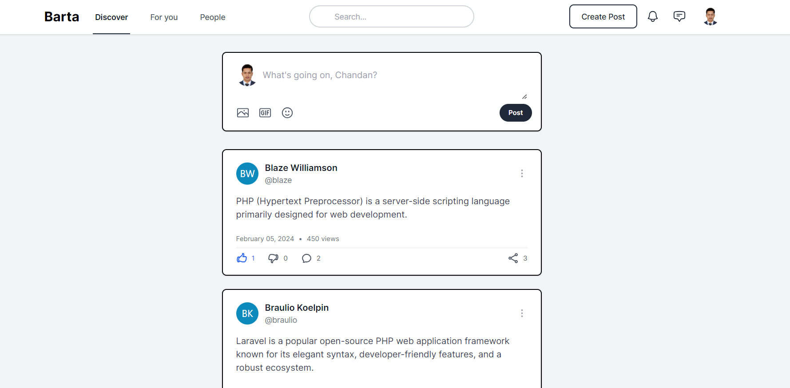

<h3 align="center">Barta App</h3>

#### Why?
Barta App is a minimal and elegant social media platform. 
It is simple, easy to use, and user-friendly, allowing users 
to share their thoughts, ideas, and experiences with others.

#### Features
- User authentication
- User profile view and update
- Barta create, edit and delete
- Barta likes, dislikes and comments
- Barta search and many more features are on the way in development.

#### Tech used

- [Laravel](https://laravel.com)
- [PHP](https://www.php.net)
- [MySQL](https://www.mysql.com)
- [Inertia.js](https://inertiajs.com)
- [Vue.js](https://vuejs.org)
- [Tailwind CSS](https://tailwindcss.com)

#### How to run
Follow the instructions

- Clone the repository
- Run `composer install`
- Run `npm install && npm run dev`
- Copy the `.env.example` file to `.env` and configure your database
- Run `php artisan key:generate` to generate the application key
- Run `php artisan migrate --seed` to create the database tables and seed the database
- Run `php artisan serve` to start the server and access the application

#### Inspiration

The UI of this project is largely inspired by [GitHub](https://github.com/alnahian2003/barta-template).

#### Caution
This project is intended for experiment.

#### Contribution
Ideas and contributions are welcome! 🙌

